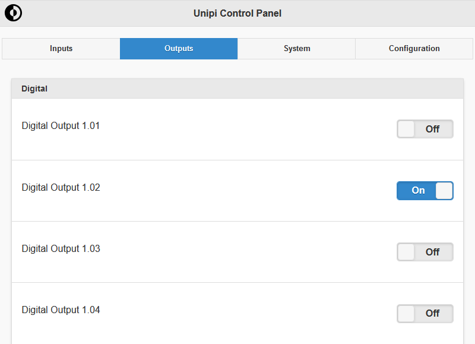
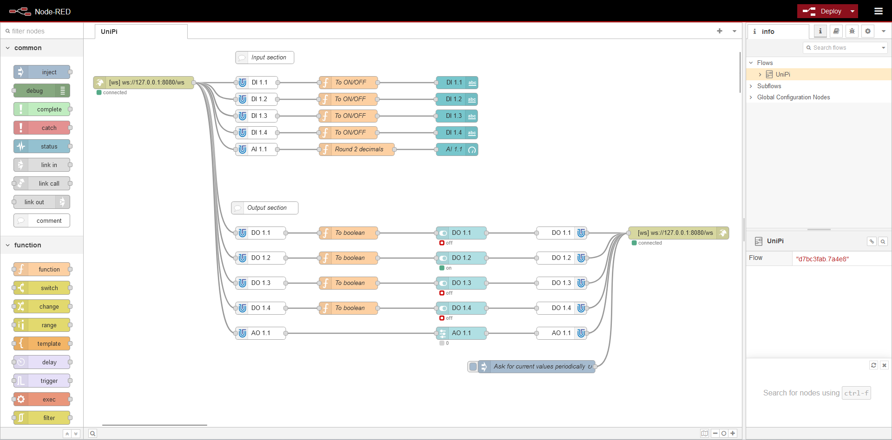

# Introduction

Evok is the primary API for accessing I/Os of [NEURON], [PATRON], [GATE] and [Unipi 1.1] devices including [Extension modules] by [Unipi technology]. Evok is a translation layer between its provided APIs and Modbus, which Unipi PLCs use, you can look at their [reference](https://kb.unipi.technology/en:sw:02-apis:02-modbus-tcp). You can also checkout [Evok API documentation](https://unipitechnology.stoplight.io/docs/evok).

It provides multiple ways to easily access the I/Os of the devices, including:

- RESTful WebForms API
- RESTful JSON API
- Bulk request JSON API
- WebSocket API
- JSON-RPC API

Besides that, Evok also supports sending notifications via webhook.

[evok-web](https://github.com/UniPiTechnology/evok-web-jq) is a simple demo web application using Evok demonstrating its usage and allowing easy control of the devices configured in Evok.

## First steps

Quickly start using Evok:

- In order to use Evok, you need any [Unipi controller](https://www.unipi.technology/shop/).
- Obtain an OS for controller of your choice, either [Base OS or Node-RED OS](https://kb.unipi.technology/en:files:software:os-images:00-start).
- Use service mode to flash [Patron](https://kb.unipi.technology/en:hw:007-patron:service-mode) or [Gate](https://kb.unipi.technology/en:hw:025-gate:service-mode), for Neuron, [flash an SD card](https://kb.unipi.technology/en:hw:02-neuron:image).
- Install Evok, you can skip this step if you do not need Evok-web on Node-RED OS:
    - Connect to the unit via [ssh](https://kb.unipi.technology/en:automation:unipi-ssh-connect-hidden#selecting_a_suitable_communication_software)
    - Run `apt update` command, then install Evok by `apt install -y evok`, if you want also the demo web inteface, execute `apt install -y evok-web`, for detailed walktrough see the [detailed article](./installation.md).
- You can try to use the API using bash or Node-RED, ([more information about API](./apis.md)):

=== "Bash"

    Following commands will work only via SSH, executed on the unit itself. If you wish to open the API from elsewhere, edit [configuration of Evok](./configs/evok_configuration.md#api-settings).

    - Returning the state of digital input DI 1_01 `curl --request GET --url http://<your-ip>:8080/json/di/1_01 --header 'Accept: text/html, application/json'`
    - Switch on the DO 1_01: `curl --request POST --url http://192.168.1.2:8080/json/do/1_01 --header 'Accept: application/json' --header 'Content-Type: application/json' --data '{"value": 1}'`
    - Switch off the DO 1_01: `curl --request POST --url http://192.168.1.2:8080/json/do/1_01 --header 'Accept: application/json' --header 'Content-Type: application/json' --data '{"value": 0}'`

=== "Evok web"

    Open `http://<unit-IP-adrress>/` and toggle some outputs:
    

=== "Node-RED"

    Open `http://<unit-IP-adrress>:1880/` and try the default Node-RED project.
    

[NEURON]:https://www.unipi.technology/products/unipi-neuron-3?categoryId=2
[PATRON]:https://www.unipi.technology/products/unipi-patron-374
[GATE]:https://www.unipi.technology/products/unipi-gate-388
[Unipi 1.1]:https://www.unipi.technology/products/unipi-1-1-1-1-lite-19?categoryId=1
[Extension modules]:https://www.unipi.technology/products?category=32
[Unipi technology]:https://www.unipi.technology/
